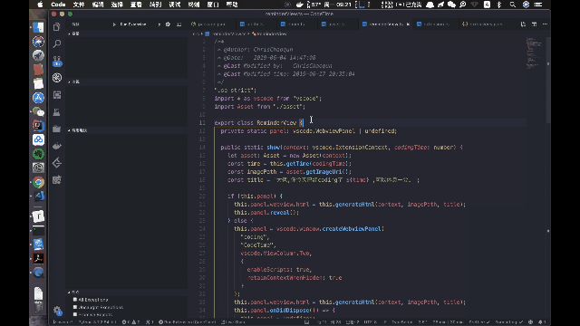

# CodingTimeHelper
## Demo

## Running the project
- Open it in VS Code
- `npm install`
- `npm run compile`
- `F5` to start debugging

Or
- Make sure hava Node.js
- `npm install -g yo generator-code
` in bash
- Run the generator `yo code` and start new project
- Study with code